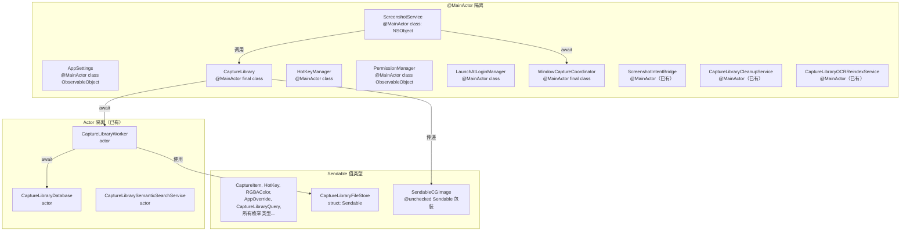
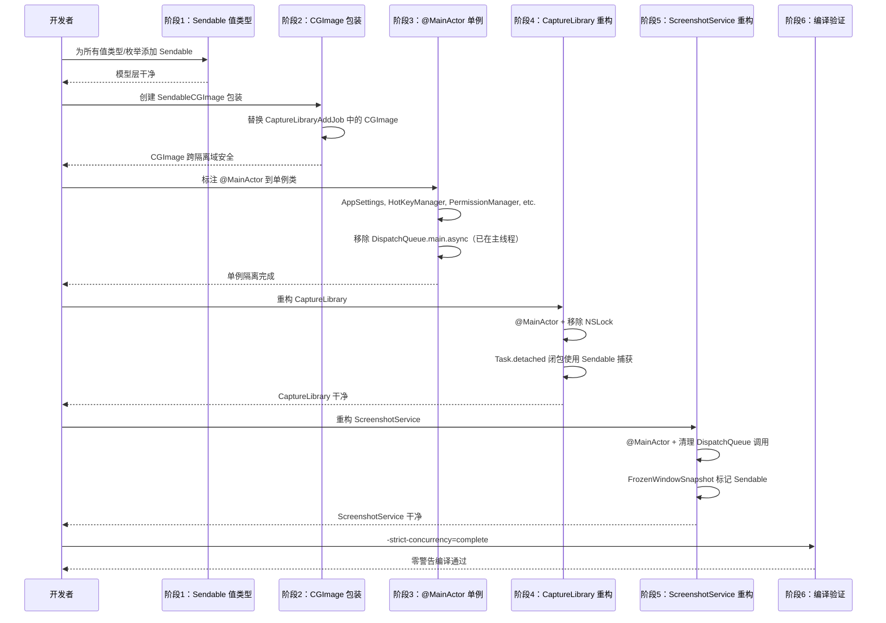

# 设计文档：Swift 6 严格并发迁移

## 概述

本设计文档描述将 PastScreen macOS 应用从 Swift 5 并发模式迁移到 Swift 6 严格并发（`-strict-concurrency=complete`）的技术方案。这是一次纯重构——零功能变更、零 UI 变更，目标是消除所有数据竞争隐患，使项目在 Swift 6 语言模式下干净编译。

核心挑战在于：项目大量使用全局单例（`static let shared`）、`@Published` 属性从多线程访问、`Task.detached` 捕获非 `Sendable` 类型、以及 `NSLock` 手动同步等 Swift 5 时代的模式。这些模式在 Swift 6 的严格并发检查下会产生数百个编译错误。

迁移策略遵循"语义正确性优先，性能需实测验证"原则：优先使用 `@MainActor` 标注（因为大部分单例本质上是 UI 层对象）、为值类型添加 `Sendable` 一致性、用 `@unchecked Sendable` 包装 Core Foundation 线程安全但未标记 `Sendable` 的类型（如 `CGImage`），以及将手动锁替换为 actor 隔离。注意：跨 actor 调用可能产生 hop（调度开销），大部分场景成本可接受，但需在迁移后实测验证关键路径的性能。

**隔离策略判据**（不是所有单例都应该 `@MainActor`）：
- **UI 状态对象**（持有 `@Published`、驱动 SwiftUI 视图）→ `@MainActor`
- **纯后台服务**（无 UI 状态、CPU 密集型）→ `actor` 或自定义 executor
- **混合对象**（既有 UI 状态又有后台逻辑）→ 拆分职责

本项目中，所有全局单例（`AppSettings`、`HotKeyManager`、`PermissionManager`、`LaunchAtLoginManager`、`WindowCaptureCoordinator`、`CaptureLibrary`、`ScreenshotService`）均持有 UI 状态或直接驱动 UI，因此统一使用 `@MainActor`。已有的 `CaptureLibraryWorker`、`CaptureLibraryDatabase`、`CaptureLibrarySemanticSearchService` 作为纯后台服务保持 `actor` 隔离。

**迁移阶段策略**：参考 [Apple 官方 Swift 6 迁移文档](https://developer.apple.com/documentation/Swift/AdoptingSwift6)，建议先在 Swift 5 语言模式下开启 `-strict-concurrency=complete` 清理所有警告，再切换到 Swift 6 语言模式（此时严格并发检查为错误级别）。

## 架构

### 当前隔离状态

```mermaid
graph TD
    subgraph "❌ 无隔离（数据竞争风险）"
        AS[AppSettings<br/>class ObservableObject<br/>~30 @Published 属性]
        CL[CaptureLibrary<br/>final class + NSLock]
        HK[HotKeyManager<br/>class + Combine]
        PM[PermissionManager<br/>class ObservableObject]
        WCC[WindowCaptureCoordinator<br/>final class]
        SS[ScreenshotService<br/>class: NSObject]
        LAL[LaunchAtLoginManager<br/>class]
    end

    subgraph "✅ 已有 Actor 隔离"
        CLW[CaptureLibraryWorker<br/>actor]
        CLD[CaptureLibraryDatabase<br/>actor]
        CLSS[CaptureLibrarySemanticSearchService<br/>actor]
    end

    subgraph "✅ 已有 @MainActor"
        SIB[ScreenshotIntentBridge<br/>@MainActor]
        CLCS[CaptureLibraryCleanupService<br/>@MainActor]
        OCRS[CaptureLibraryOCRReindexService<br/>@MainActor]
    end

    AS -->|"跨线程读取"| CL
    AS -->|"跨线程读取"| HK
    AS -->|"跨线程读取"| SS
    AS -->|"跨线程读取"| WCC
    CL -->|"拥有"| CLW
    CLW -->|"拥有"| CLD
    SS -->|"调用"| WCC
    SS -->|"调用"| CL
    SIB -->|"调用"| SS
```

### 迁移后隔离状态




## 主要迁移流程



## 组件与接口

### 组件 1：Sendable 值类型层

**目的**：为所有跨隔离域传递的值类型和枚举添加 `Sendable` 一致性。

**接口变更**：

```swift
// === 枚举：添加 Sendable ===
enum CaptureItemCaptureType: Int, Codable, CaseIterable, Sendable { ... }
enum CaptureItemCaptureMode: Int, Codable, CaseIterable, Sendable { ... }
enum CaptureItemTrigger: Int, Codable, CaseIterable, Sendable { ... }
enum CaptureTrigger: String, Sendable { ... }
enum AppCategory: Sendable { ... }
enum ClipboardFormat: String, Codable, CaseIterable, Identifiable, Sendable { ... }
enum CaptureClipboardFormat: String, Codable, CaseIterable, Identifiable, Sendable { ... }
enum OCRClipboardFormat: String, Codable, CaseIterable, Identifiable, Sendable { ... }
enum AppLanguage: String, CaseIterable, Identifiable, Sendable { ... }
enum PermissionType: CaseIterable, Sendable { ... }
enum PermissionStatus: Sendable { ... }
enum CaptureLibrarySort: Int, CaseIterable, Hashable, Sendable { ... }
enum OCRServiceError: LocalizedError, Sendable { ... }
enum WindowCaptureError: LocalizedError, Sendable { ... }

// === 结构体：添加 Sendable ===
struct HotKey: Codable, Equatable, Sendable { ... }
struct AppOverride: Codable, Identifiable, Equatable, Sendable { ... }
struct RGBAColor: Codable, Equatable, Sendable { ... }
struct CaptureItem: Identifiable, Hashable, Sendable { ... }
struct CaptureLibraryAppGroup: Identifiable, Hashable, Sendable { ... }
struct CaptureLibraryTagGroup: Identifiable, Hashable, Sendable { ... }
struct CaptureLibraryQuery: Hashable, Sendable { ... }
struct CaptureLibraryStats: Hashable, Sendable { ... }
struct CaptureLibraryCleanupPolicy: Hashable, Sendable { ... }
struct CaptureLibraryPreviewCandidate: Hashable, Sendable { ... }
struct CaptureLibraryOCRReindexCandidate: Hashable, Sendable { ... }
struct CaptureLibraryFileStore: Sendable { ... }
struct WindowHitTestResult: Sendable { ... }
struct OCRLanguageOption: Sendable { ... }  // 如果存在
```

**职责**：
- 所有纯值类型的枚举和结构体声明 `Sendable`
- 编译器自动验证所有存储属性也是 `Sendable`
- `CaptureLibraryFileStore` 所有属性均为 `URL`（`Sendable`），可直接声明

### 组件 2：SendableCGImage 包装

**目的**：`CGImage` 是线程安全的 Core Foundation 类型，但 Apple 未将其标记为 `Sendable`。需要一个 `@unchecked Sendable` 包装来安全地跨隔离域传递。

**接口**：

```swift
/// CGImage 的 Sendable 包装。
/// SAFETY: CGImage 是不可变的、引用计数的 Core Foundation 类型。
/// 一旦创建，其像素数据不可修改，多线程读取是安全的。
/// Apple 未将其标记为 Sendable，但 Core Foundation 文档确认其线程安全性。
struct SendableCGImage: @unchecked Sendable {
    let image: CGImage

    init(_ image: CGImage) {
        self.image = image
    }
}
```

**使用场景**：
- `CaptureLibraryAddJob.cgImage` → `SendableCGImage`
- `ScreenshotService.FrozenWindowSnapshot.image` → `SendableCGImage`
- `ScreenshotService.frozenDisplaySnapshots` 字典值 → `SendableCGImage`
- `WindowCaptureResult.image` → `SendableCGImage`

### 组件 3：@MainActor 单例类

**目的**：将所有全局单例标注为 `@MainActor`，因为它们本质上都是 UI 层对象，所有有意义的访问都发生在主线程。

#### AppSettings

```swift
@MainActor
class AppSettings: ObservableObject {
    static let shared = AppSettings()
    // 所有 @Published 属性保持不变
    // 移除 nonisolated 标记（normalizeOCRRecognitionLanguages 除外，它是纯函数）
    
    nonisolated static func normalizeOCRRecognitionLanguages(_ raw: [String]) -> [String] {
        // 纯函数，无状态访问，保持 nonisolated
    }
}
```

#### HotKeyManager

```swift
@MainActor
class HotKeyManager {
    static let shared = HotKeyManager()
    // 移除 DispatchQueue.main.async 包装（已在 @MainActor）
    // NSEvent.addGlobalMonitorForEvents 回调需要 MainActor.assumeIsolated 或 Task { @MainActor }
}
```

#### PermissionManager

```swift
@MainActor
class PermissionManager: ObservableObject {
    static let shared = PermissionManager()
    // 移除 DispatchQueue.main.async 包装
    // UNUserNotificationCenter 回调使用 Task { @MainActor in }
}
```

#### LaunchAtLoginManager

```swift
@MainActor
class LaunchAtLoginManager {
    static let shared = LaunchAtLoginManager()
    // 简单类，无并发问题
}
```

#### WindowCaptureCoordinator

```swift
@MainActor
final class WindowCaptureCoordinator {
    static let shared = WindowCaptureCoordinator()
    // captureWindow() 已经是 async，保持不变
    // hitTest 方法是同步的，在 @MainActor 上下文中安全
}
```

### 组件 4：CaptureLibrary 重构

**目的**：将 `CaptureLibrary` 从 `NSLock` 手动同步迁移到 `@MainActor` 隔离。

```swift
@MainActor
final class CaptureLibrary {
    static let shared = CaptureLibrary()

    private let worker = CaptureLibraryWorker()
    // 移除 pendingLock / indexingLock（@MainActor 保证单线程访问）
    private var pendingJobs: Int = 0
    private let maxPendingJobs: Int = 8
    private var pendingIndexJobs: Int = 0
    private let maxPendingIndexJobs: Int = 2

    // enqueue 方法：Task.detached 闭包只捕获 Sendable 值
    @discardableResult
    private func enqueue(
        priority: TaskPriority,
        operation: @Sendable @escaping (CaptureLibraryWorker) async throws -> Void
    ) -> Bool {
        guard acquireJobSlot() else { return false }

        Task.detached(priority: priority) { [weak self] in
            defer {
                Task { @MainActor [weak self] in
                    self?.releaseJobSlot()
                }
            }
            do {
                // worker 是 actor，跨隔离域访问是安全的
                try await operation(CaptureLibrary.shared.worker)
            } catch {
                logError("CaptureLibrary job failed: \(error.localizedDescription)", category: "LIB")
            }
        }
        return true
    }
}
```

**关键变更**：
- `CaptureLibraryAddJob` 使用 `SendableCGImage` 替代 `CGImage`，并声明 `Sendable`
- 移除 `NSLock`（`pendingLock` / `indexingLock`），`@MainActor` 保证串行访问
- `enqueue` 闭包参数标记 `@Sendable`
- `notifyChanged()` 在 actor 内部改为 `await MainActor.run { ... }`（需要顺序保证时）或 `Task { @MainActor in ... }`（允许延后通知时）——见组件 6 详细说明

**关于 `Task.detached` 的使用**：
- `enqueue()` 中使用 `Task.detached` 是刻意的：需要切断 `@MainActor` 继承，让后台任务在非主线程执行
- 这是 `Task.detached` 的正当用例——明确要切断继承上下文（actor 隔离、优先级）
- 在其他场景中，优先使用结构化并发（`async let`、`TaskGroup`），仅在需要切断上下文继承时才用 `detached`
- 注意：`Task.detached` 不继承取消链，调用者需要自行管理取消

### 组件 5：ScreenshotService 重构

**目的**：将 `ScreenshotService` 标注为 `@MainActor`，清理 `DispatchQueue` 调用。

```swift
@MainActor
class ScreenshotService: NSObject, SelectionWindowDelegate {
    // FrozenWindowSnapshot 标记 Sendable
    // 注意：SCRunningApplication 不是 Sendable，需要在存储时扁平化
    private struct FrozenWindowSnapshot: Sendable {
        let image: SendableCGImage              // 替换 CGImage
        let padding: EdgeInsetValues            // 使用 Sendable 替代 NSEdgeInsets
        let pointSize: CGSize
        let borderApplied: Bool
        let scale: CGFloat
        let appBundleID: String?                // 扁平化自 SCRunningApplication
        let appName: String?                    // 扁平化自 SCRunningApplication
    }

    // DispatchQueue.main.asyncAfter → Task + Task.sleep（注意语义差异）
    // DispatchQueue.main.async → 直接调用（已在 @MainActor）
    // saveQueue (DispatchQueue) → Task.detached(priority: .utility)
    //   ↑ 这里 detached 是正当用例：需要切断 @MainActor 继承，在后台线程执行 I/O
    // AutomationRequest 标记 Sendable
}
```

**关键变更**：
- `frozenDisplaySnapshots: [CGDirectDisplayID: SendableCGImage]`
- `frozenWindowSnapshots: [CGWindowID: FrozenWindowSnapshot]`
- `DispatchQueue.main.asyncAfter(deadline:)` → `Task { try? await Task.sleep(nanoseconds:); ... }`
- `saveQueue.async { }` → `Task.detached(priority: .utility) { }`
- `AutomationRequest` 标记 `Sendable`

### 组件 6：CaptureLibraryWorker Actor 修复

**目的**：修复 actor 内部的隔离边界问题。

```swift
actor CaptureLibraryWorker {
    // notifyChanged() 有两种策略，根据调用场景选择：
    
    // 策略 A：需要顺序保证时（如 addCapture 后立即通知 UI 刷新）
    // 使用 await MainActor.run，确保通知在当前 await 链中同步完成
    private func notifyChangedSync() async {
        await MainActor.run {
            NotificationCenter.default.post(name: .captureLibraryChanged, object: nil)
        }
    }
    
    // 策略 B：允许延后通知时（如批量操作中间步骤）
    // 使用 fire-and-forget Task，通知可能异步漂移
    private func notifyChangedAsync() {
        Task { @MainActor in
            NotificationCenter.default.post(name: .captureLibraryChanged, object: nil)
        }
    }

    // CaptureLibraryFileStore 已是 Sendable，可安全在 actor 内使用
    // CaptureLibraryDatabase 已是 actor，跨 actor 调用使用 await
}
```

### 组件 7：CaptureLibraryDatabase Actor 修复

**目的**：处理 `OpaquePointer` 的 `Sendable` 问题。

```swift
actor CaptureLibraryDatabase {
    private let dbURL: URL
    // OpaquePointer 不是 Sendable，但它被 actor 隔离保护
    // 不需要额外处理——actor 本身保证了串行访问
    private var db: OpaquePointer?
}
```

**说明**：`OpaquePointer` 存储在 actor 内部，不会跨隔离域传递，因此不需要 `@unchecked Sendable`。Actor 的隔离机制已经保证了安全性。

## 数据模型

### CaptureLibraryAddJob（迁移后）

```swift
struct CaptureLibraryAddJob: Sendable {
    let id: UUID
    let createdAt: Date

    let captureType: CaptureItemCaptureType   // Sendable 枚举
    let captureMode: CaptureItemCaptureMode   // Sendable 枚举
    let trigger: CaptureItemTrigger           // Sendable 枚举

    let appBundleID: String?
    let appName: String?
    let appPID: Int?
    let selectionSize: CGSize                 // Sendable

    let externalFilePath: String?

    let cgImage: SendableCGImage              // ← 替换 CGImage
    let storePreview: Bool

    let ocrText: String?
    let ocrLangs: [String]

    let autoOCR: Bool
    let autoOCRPreferredLanguages: [String]
}
```

### WindowCaptureResult（迁移后）

迁移后不再直接传递 `SCWindow` / `SCRunningApplication`（非 Sendable），而是在捕获点立即扁平化为纯值 DTO：

```swift
/// 替代原 WindowCaptureResult，所有字段均为 Sendable
struct WindowCaptureInfo: Sendable {
    let image: SendableCGImage
    let windowFrame: CGRect
    let appBundleID: String?
    let appName: String?
    let paddingPoints: EdgeInsetValues
}

/// NSEdgeInsets 的 Sendable 替代
struct EdgeInsetValues: Sendable {
    let top: CGFloat
    let left: CGFloat
    let bottom: CGFloat
    let right: CGFloat
    
    static let zero = EdgeInsetValues(top: 0, left: 0, bottom: 0, right: 0)
    
    init(top: CGFloat, left: CGFloat, bottom: CGFloat, right: CGFloat) {
        self.top = top; self.left = left; self.bottom = bottom; self.right = right
    }
    
    init(_ insets: NSEdgeInsets) {
        self.top = insets.top; self.left = insets.left
        self.bottom = insets.bottom; self.right = insets.right
    }
}
```

`WindowCaptureCoordinator.captureWindow()` 的返回类型从 `WindowCaptureResult` 改为 `WindowCaptureInfo`，在方法内部完成 `SCWindow` → 纯值的转换：

```swift
@MainActor
func captureWindow(with windowID: CGWindowID, applyBorder: Bool = true) async throws -> WindowCaptureInfo {
    // ... 原有捕获逻辑 ...
    let result = // SCScreenshotManager.captureImage(...)
    // 在返回前扁平化，不传递 SCWindow/SCRunningApplication
    return WindowCaptureInfo(
        image: SendableCGImage(finalImage),
        windowFrame: scWindow.frame,
        appBundleID: scWindow.owningApplication?.bundleIdentifier,
        appName: scWindow.owningApplication?.applicationName,
        paddingPoints: EdgeInsetValues(paddingPoints)
    )
}
```


## 算法伪代码与形式化规约

### 算法 1：@MainActor 单例迁移

```swift
// 前置条件：
//   - 类是全局单例（static let shared）
//   - 类的所有有意义的访问都发生在主线程
//   - 类持有 @Published 属性或 UI 状态
//
// 后置条件：
//   - 类标注 @MainActor
//   - 所有 DispatchQueue.main.async/asyncAfter 调用被移除或替换
//   - 纯函数保持 nonisolated
//   - 编译器验证所有跨隔离域访问使用 await

// 步骤：
// 1. 在 class 声明前添加 @MainActor
// 2. 扫描所有 DispatchQueue.main.async { ... }：
//    - 如果在 @MainActor 方法内 → 移除包装，直接执行
//    - 如果在非隔离上下文（如 Combine sink）→ 替换为 Task { @MainActor in ... }
// 3. 扫描所有 DispatchQueue.main.asyncAfter(deadline:) { ... }：
//    - 替换为 Task { try? await Task.sleep(nanoseconds:); ... }
// 4. 标记纯函数为 nonisolated（无状态访问的 static 方法）
// 5. 编译验证
```

**前置条件**：
- 目标类是全局单例，通过 `static let shared` 访问
- 类的所有 `@Published` 属性仅从主线程有意义地读写
- 类不在后台线程执行 CPU 密集型计算

**后置条件**：
- 类声明包含 `@MainActor`
- 类内部不存在 `DispatchQueue.main.async` 或 `DispatchQueue.main.asyncAfter`
- 所有从非 `@MainActor` 上下文访问该类的代码使用 `await`
- 纯函数（无状态访问）标记为 `nonisolated`

**循环不变量**：N/A（非循环算法）

### 算法 2：NSLock → @MainActor 迁移（CaptureLibrary）

```swift
// 前置条件：
//   - CaptureLibrary 使用 NSLock 保护 pendingJobs 计数器
//   - 所有 lock/unlock 调用配对正确
//   - enqueue() 的 Task.detached 闭包捕获 non-Sendable 类型
//
// 后置条件：
//   - NSLock 被移除
//   - pendingJobs 由 @MainActor 隔离保护
//   - Task.detached 闭包只捕获 Sendable 值
//   - 功能行为完全不变

// 迁移步骤：
// 1. 添加 @MainActor 到 CaptureLibrary
// 2. 移除 pendingLock / indexingLock 声明
// 3. acquireJobSlot() / releaseJobSlot() 变为普通方法（@MainActor 保证串行）
// 4. enqueue() 的 operation 参数标记 @Sendable
// 5. CaptureLibraryAddJob 中 CGImage → SendableCGImage
// 6. 编译验证
```

**前置条件**：
- `pendingLock.lock()` 和 `pendingLock.unlock()` 总是配对出现
- `pendingJobs` 只在 lock 保护下读写
- `enqueue()` 返回 `Bool` 表示是否成功入队

**后置条件**：
- 不存在 `NSLock` 实例
- `pendingJobs` 的读写只发生在 `@MainActor` 上下文
- `enqueue()` 的语义不变：超过 `maxPendingJobs` 时返回 `false`
- `Task.detached` 闭包不捕获任何 non-`Sendable` 值

### 算法 3：DispatchQueue.main.asyncAfter → Task.sleep 替换

```swift
// 前置条件：
//   - 代码在 @MainActor 上下文中
//   - DispatchQueue.main.asyncAfter(deadline: .now() + delay) { closure }
//
// 后置条件：
//   - 替换为 Task { @MainActor in try? await Task.sleep(nanoseconds:); closure }
//   - 延迟时间近似等价（注意：不完全等价，见下方说明）
//   - 闭包中的 self 捕获语义不变
//
// ⚠️ 语义差异说明：
//   - 取消行为不同：Task 可被取消，DispatchQueue 不可
//   - 时钟语义不同：Task.sleep 使用 continuous clock
//   - 任务生命周期：需确保 Task 不成为"孤儿任务"（无人持有引用）
//   - 建议：优先在已有任务上下文中 sleep，避免创建新的 fire-and-forget Task

// 模式：
// 之前：
DispatchQueue.main.asyncAfter(deadline: .now() + 0.15) { [weak self] in
    guard let self else { return }
    self.doSomething()
}

// 之后（推荐：在已有 async 上下文中）：
try? await Task.sleep(nanoseconds: 150_000_000)
doSomething()

// 之后（无 async 上下文时）：
Task { @MainActor [weak self] in
    try? await Task.sleep(nanoseconds: 150_000_000)
    guard let self else { return }
    self.doSomething()
}
```

**前置条件**：
- 原始代码使用 `DispatchQueue.main.asyncAfter`
- 闭包在主线程执行

**后置条件**：
- 替换后的代码在 `@MainActor` 上下文执行
- 延迟时间近似等价（秒 × 1_000_000_000 = 纳秒），但时钟语义不同（continuous clock vs wall clock）
- `[weak self]` 捕获语义保持不变
- 注意：新的 Task 可被取消（原 DispatchQueue 版本不可取消），需确认取消行为是否可接受

### 算法 4：Combine sink 中的隔离修复

```swift
// 前置条件：
//   - Combine publisher 的 sink 闭包访问 @MainActor 隔离的属性
//   - 当前使用 DispatchQueue.main.async 或 .receive(on: DispatchQueue.main)
//
// 后置条件：
//   - sink 闭包使用 Task { @MainActor in } 或 .receive(on: RunLoop.main)
//   - 编译器验证隔离正确性

// 模式 A（推荐）：使用 @MainActor Task
settingsObserver = settings.$globalHotkeyEnabled.sink { [weak self] enabled in
    Task { @MainActor [weak self] in
        guard let self else { return }
        if enabled {
            self.startMonitoring()
        } else {
            self.stopMonitoring()
        }
    }
}

// 模式 B（最后手段）：使用 MainActor.assumeIsolated
// ⚠️ 仅当已证明回调一定在主线程执行时使用
// ⚠️ 本质是 unsafe 假设，运行时违反会崩溃
// ⚠️ 必须附带注释说明为何安全
settingsObserver = settings.$globalHotkeyEnabled
    .receive(on: DispatchQueue.main)
    .sink { [weak self] enabled in
        // SAFETY: .receive(on: DispatchQueue.main) 保证此闭包在主线程执行
        MainActor.assumeIsolated {
            if enabled {
                self?.startMonitoring()
            } else {
                self?.stopMonitoring()
            }
        }
    }
```

## 关键函数形式化规约

### `SendableCGImage.init(_:)`

```swift
init(_ image: CGImage)
```

**前置条件**：
- `image` 是有效的 `CGImage` 实例

**后置条件**：
- `self.image === image`（引用相同）
- 包装后的值可安全跨隔离域传递

### `CaptureLibrary.enqueue(priority:operation:)`

```swift
@MainActor
@discardableResult
private func enqueue(
    priority: TaskPriority,
    operation: @Sendable @escaping (CaptureLibraryWorker) async throws -> Void
) -> Bool
```

**前置条件**：
- 调用者在 `@MainActor` 上下文
- `operation` 闭包是 `@Sendable`（不捕获 non-Sendable 值）

**后置条件**：
- 如果 `pendingJobs < maxPendingJobs`：`pendingJobs` 增加 1，返回 `true`，`operation` 被调度执行
- 如果 `pendingJobs >= maxPendingJobs`：返回 `false`，`operation` 不执行
- `operation` 完成后，`pendingJobs` 减少 1（通过 `Task { @MainActor in }` 回到主线程）

**循环不变量**：`0 <= pendingJobs <= maxPendingJobs`

### `AppSettings.normalizeOCRRecognitionLanguages(_:)`

```swift
nonisolated static func normalizeOCRRecognitionLanguages(_ raw: [String]) -> [String]
```

**前置条件**：
- `raw` 是任意字符串数组

**后置条件**：
- 返回值中每个元素都是规范化的 BCP-47 语言标签
- 返回值中无重复元素
- 返回值中无空字符串
- 函数无副作用（纯函数）
- 可从任何隔离域安全调用

## 示例用法

### 迁移前后对比：CaptureLibrary.addCapture

```swift
// ===== 迁移前 =====
// CaptureLibraryAddJob 包含 CGImage（non-Sendable）
// enqueue 使用 Task.detached 捕获 job（non-Sendable）
let job = CaptureLibraryAddJob(
    // ...
    cgImage: cgImage,  // ❌ CGImage 不是 Sendable
    // ...
)
// Task.detached 捕获 non-Sendable 的 job → Swift 6 编译错误
Task.detached(priority: priority) { [weak self] in
    try await operation(CaptureLibrary.shared.worker)
}

// ===== 迁移后 =====
// CaptureLibraryAddJob 使用 SendableCGImage，整个结构体是 Sendable
let job = CaptureLibraryAddJob(
    // ...
    cgImage: SendableCGImage(cgImage),  // ✅ Sendable
    // ...
)
// operation 标记 @Sendable，编译器验证闭包捕获
Task.detached(priority: priority) { [weak self] in
    try await operation(CaptureLibrary.shared.worker)  // ✅ worker 是 actor
}
```

### 迁移前后对比：HotKeyManager 事件监听

```swift
// ===== 迁移前 =====
settingsObserver = settings.$globalHotkeyEnabled.sink { [weak self] enabled in
    DispatchQueue.main.async {  // 手动跳转主线程
        if enabled {
            self?.startMonitoring()
        } else {
            self?.stopMonitoring()
        }
    }
}

// ===== 迁移后 =====
// HotKeyManager 已是 @MainActor，sink 闭包需要显式跳转
settingsObserver = settings.$globalHotkeyEnabled.sink { [weak self] enabled in
    Task { @MainActor [weak self] in
        guard let self else { return }
        if enabled {
            self.startMonitoring()
        } else {
            self.stopMonitoring()
        }
    }
}
```

### 迁移前后对比：ScreenshotService 延迟执行

```swift
// ===== 迁移前 =====
DispatchQueue.main.asyncAfter(deadline: .now() + 0.05) { [weak screenshotService] in
    screenshotService?.captureScreenshot(trigger: source)
}

// ===== 迁移后 =====
Task { @MainActor [weak screenshotService] in
    try? await Task.sleep(nanoseconds: 50_000_000)
    screenshotService?.captureScreenshot(trigger: source)
}
```

## 正确性属性

1. **∀ 值类型 T ∈ {CaptureItem, HotKey, RGBAColor, AppOverride, ...}：T 遵循 Sendable**
   - 编译器静态验证所有存储属性也是 Sendable

2. **∀ 全局单例 S ∈ {AppSettings, HotKeyManager, PermissionManager, ...}：S 标注 @MainActor**
   - 编译器验证所有跨隔离域访问使用 await

3. **∀ Task.detached 闭包 C：C 只捕获 Sendable 值**
   - 编译器在 `-strict-concurrency=complete` 下静态验证

4. **∀ actor A ∈ {CaptureLibraryWorker, CaptureLibraryDatabase}：A 内部不使用 DispatchQueue.main.async**
   - 改为 `Task { @MainActor in }` 或 `await MainActor.run { }`

5. **迁移后不存在 NSLock 实例**
   - `@MainActor` 隔离替代手动锁

6. **∀ CGImage 跨隔离域传递：使用 SendableCGImage 包装**
   - 编译器验证 `CGImage` 不直接出现在 `@Sendable` 闭包捕获中

7. **零功能变更：所有现有测试通过**
   - 运行时行为与迁移前完全一致

## 错误处理

### 场景 1：NSEvent 全局监听器回调隔离

**条件**：`NSEvent.addGlobalMonitorForEvents` 的回调不在 `@MainActor` 上下文
**响应**：回调内部使用 `MainActor.assumeIsolated { }` 或 `Task { @MainActor in }`
**恢复**：编译器验证隔离正确性

### 场景 2：Combine sink 闭包隔离

**条件**：`$property.sink { }` 闭包不自动继承 `@MainActor` 隔离
**响应**：优先使用 `Task { @MainActor in }` 包装；`MainActor.assumeIsolated` 仅作为最后手段，且必须附带 SAFETY 注释证明回调一定在主线程
**恢复**：编译器验证 + 运行时 TSan 检查

### 场景 3：SCRunningApplication / SCWindow 非 Sendable

**条件**：ScreenCaptureKit 类型未标记 `Sendable`，但需要跨隔离域传递
**响应**：在使用点立即提取所需值（bundleIdentifier、frame 等）到 `Sendable` 结构体（如 `WindowCaptureInfo`），禁止传递原始对象跨隔离域
**恢复**：如果 Apple 未来为这些类型添加 `Sendable`，可简化回直接传递；使用 `@preconcurrency import ScreenCaptureKit` 抑制同一隔离域内的警告

### 场景 4：deinit 中访问 @MainActor 属性

**条件**：`deinit` 不在任何 actor 上下文中运行
**响应**：将清理逻辑移到 `stop()` 方法中，在 `deinit` 中只做最小清理（如 `NotificationCenter.removeObserver`）
**恢复**：确保 `stop()` 在对象释放前被调用

## `@unchecked Sendable` 治理规范

使用 `@unchecked Sendable` 是绕过编译器检查的 escape hatch，必须严格管控：

### 规则

1. **每个 `@unchecked Sendable` 类型必须附带线程安全论证注释**：

```swift
/// CGImage 的 Sendable 包装。
/// SAFETY: CGImage 是不可变的、引用计数的 Core Foundation 类型。
/// 一旦创建，其像素数据不可修改，多线程读取是安全的。
/// Apple 未将其标记为 Sendable，但 Core Foundation 文档确认其线程安全性。
struct SendableCGImage: @unchecked Sendable {
    let image: CGImage
}
```

2. **必须限制可变状态暴露**：`@unchecked Sendable` 包装只能包含 `let` 属性，禁止 `var`

3. **Code Review 必须带"为何安全"的注释模板**：
   - `// SAFETY: [类型名] is thread-safe because [原因]`
   - 没有 SAFETY 注释的 `@unchecked Sendable` 不允许合并

4. **项目中允许的 `@unchecked Sendable` 类型清单**：
   - `SendableCGImage`：包装 `CGImage`（不可变 CF 类型）
   - 如需新增，必须在此清单中登记并附带论证

## `@preconcurrency import` 审计

第三方框架和系统框架中未标记 `Sendable` 的类型会产生大量警告。使用 `@preconcurrency import` 可以临时抑制：

```swift
@preconcurrency import ScreenCaptureKit  // SCWindow, SCRunningApplication 等
@preconcurrency import Vision             // VNRecognizeTextRequest 等（如需要）
```

### 管理规则

1. **维护一份 `@preconcurrency import` 清单**，记录每个抑制的原因和预期移除时间
2. **每次 Xcode/SDK 更新后检查**：Apple 可能已为这些类型添加 `Sendable`，此时移除 `@preconcurrency`
3. **优先扁平化而非抑制**：如果可以在使用点提取值到 `Sendable` 结构体，优于 `@preconcurrency import`

## 测试策略

### 单元测试方法

- 所有现有测试（`CaptureLibraryDatabaseMigrationTests`、`CaptureLibrarySearchSyntaxParserTests`、`CaptureLibraryTagNormalizerTests`）必须在迁移后继续通过
- 测试文件可能需要添加 `@MainActor` 标注以匹配被测类的隔离域
- 不需要新增测试——这是纯重构，行为不变

### 编译验证

- **阶段 1**：在 Swift 5 语言模式下开启 `-strict-concurrency=complete`，逐步清理警告
- **阶段 2**：切换到 Swift 6 语言模式，确认所有警告升级为错误后仍零错误
- 中间验证：每个阶段完成后增量编译，确认新引入的警告数量递减

### 运行时验证

- 手动测试核心流程：截图、OCR、素材库浏览、设置修改
- 确认无运行时崩溃（特别是 actor 重入相关）
- 确认 UI 响应性不受影响

### TSan / 并发运行时检查

- **开启 Thread Sanitizer (TSan)** 运行完整测试套件和手动测试
- "零编译警告"不等于"零运行时并发问题"——TSan 可以捕获编译器无法静态检测的竞争
- 特别关注：`NotificationCenter` 通知时序、`UserDefaults` 跨线程访问、`FileManager` 操作

## 性能考量

- `@MainActor` 标注在同一隔离域内调用时无额外开销；但跨 actor 调用会产生 hop（调度），大部分场景成本可接受
- 关键路径（截图捕获 → 剪贴板复制 → UI 反馈）需在迁移后实测验证延迟无明显增加
- 移除 `NSLock` 消除了锁竞争的可能性
- `Task { @MainActor in }` 替代 `DispatchQueue.main.async` 在语义上近似等价，但取消行为和调度时机有细微差异
- `SendableCGImage` 是零成本包装（编译器优化后与直接使用 `CGImage` 等价）
- 注意避免过度串行化：CPU 密集型操作（OCR、图片缩放）必须在后台 actor/Task 中执行，不能阻塞 `@MainActor`

## 安全考量

- 迁移消除了所有潜在的数据竞争（Swift 6 编译器静态保证）
- 不引入新的安全风险
- 不改变任何权限请求或数据存储行为

## 依赖

- Swift 6 编译器（Xcode 16+）
- 无新增外部依赖
- 所有现有框架依赖保持不变：SwiftUI、AppKit、ScreenCaptureKit、Vision、NaturalLanguage、CryptoKit、SQLite3
