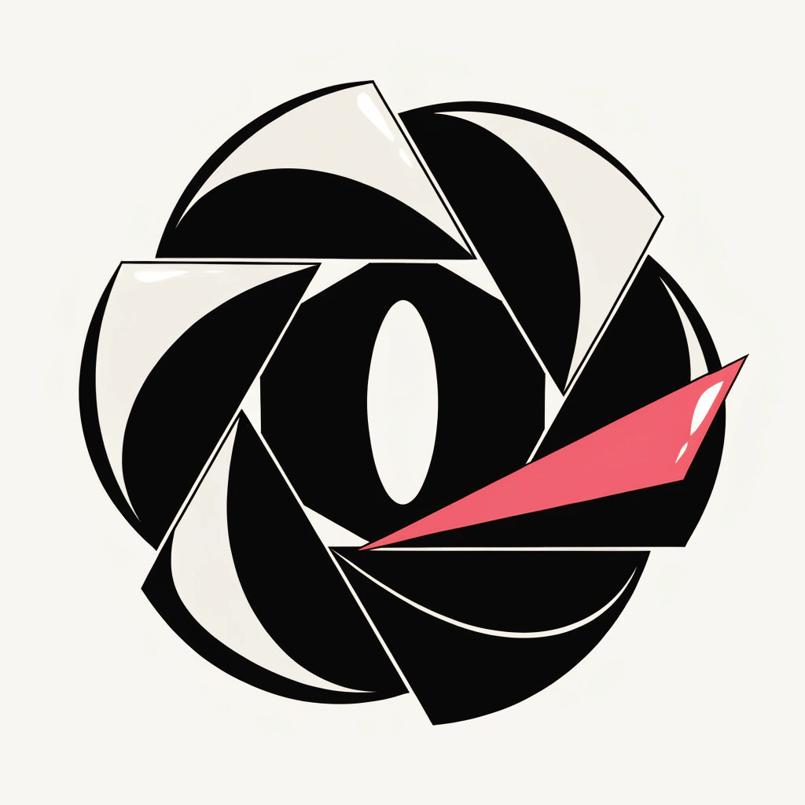

<p align="center">
  
</p>
<h1 align="center">📸 Mio</h1>
<p align="center">Lightning-fast screenshots to clipboard. Native, small, and quick.</p>
<p align="center">
  <a href="https://www.apple.com/macos/">
    
  </a>
  <a href="https://swift.org/">
    
  </a>
</p>

---

## Quick Start (User Guide)

1. **Download**: grab the latest release  
   https://github.com/iSoldLeo/Mio/releases
2. **Unblock first launch**: Right-click the app and choose *Open* once, or run  
   `xattr -dr com.apple.quarantine /Applications/Mio.app`
3. **Permissions**: follow prompts to allow *Screen Recording*, *Accessibility*, and *Notifications*.
4. **Screenshot**:
   - Selection: default ⌥⌘S (configurable in Settings)  
   - Advanced: default ⌥⌘⇧S (built-in annotator + OCR)  
   - OCR: default ⌥⌘⇧O (extract text and copy to clipboard)  
   - Full screen: menu bar “Full Screen Screenshot”
5. **Cancel / Review**: right-click inside the selection to cancel; after capture, use the menu bar to “View last screenshot”, copy from “Recent 10”, or open the Capture Library.

---

## Core Features
- Blazing-fast selection, native clipboard, no extra popups
- Advanced capture with built-in annotation + OCR, separate hotkey
- Capture Library (local): pin/tags/notes/app grouping, with search + filter syntax
- Record any combo of global/advanced hotkeys
- Menu bar app only (no Dock), with history and quick actions
- App rules: force “path only” or “image only” per app
- Configurable capture border (toggle/width/corner radius/color)
- Customize enabled editing tools and their order; quick radial tool wheel

---

## Settings Highlights
- **Hotkeys**: record in Settings > Screenshot; advanced/OCR hotkeys supported
- **Saving**: clipboard by default; to save files, choose a directory in Settings > Storage and enable saving
- **Format**: PNG or JPEG; optional border in output
- **App Rules**: set “path only” or “image only” for Terminal/IDE, etc.
- **Capture Library**: optional previews/auto OCR/semantic boost (experimental) + automatic cleanup policies
- **OCR Languages**: set in Settings > Editor > OCR; leave empty to use system default/auto-detect
- **Language**: follow system / Simplified Chinese / English / Traditional Chinese / multilingual (nl/de/fr/es/ja/ko, etc.)

---

## Capture Library Search Syntax (Optional)
The Capture Library search field supports whitespace-tokenized filters (filters are removed from the free-text query):

- `pinned` / `pin` / `置顶`
- `#tag` (also supports `＃tag`) or `tag:xxx` / `标签:xxx`
- `app:xxx` / `应用:xxx` (bundle id or app keyword, e.g. `app:com.apple.Safari` / `app:chrome`)
- `type:area|window|fullscreen` (also supports `选区/窗口/全屏`)
- Time: `today` / `yesterday` (also supports `今天/昨天`), `thisweek/lastweek`, `thismonth/lastmonth`, `thisyear/lastyear`, `7d` / `2w` / `3m`, or `2025-12-24` / `12-24`

---

## Permissions & Privacy

| Permission   | Purpose                        |
|--------------|--------------------------------|
| Screen Recording | ScreenCaptureKit screenshots |
| Accessibility    | Global hotkeys               |
| Notifications    | Completion alerts and “Show in Finder” |

Mio runs offline: no uploads, no network.

---

## FAQ
- **Hotkeys not working**: ensure Accessibility is granted; re-record the hotkey in Settings and try again.
- **Blocked on first launch**: right-click to open once, or run the `xattr` command above.

---

## Developer Info

- Stack: Swift, AppKit + SwiftUI, ScreenCaptureKit, Vision (OCR), SQLite (Capture Library); optional TipKit (macOS 14+) / AppIntents (macOS 13+)
- Local build:

```bash
git clone https://github.com/iSoldLeo/Mio.git
cd Mio
open Mio.xcodeproj
```

---

## License & Credits

- Repository under [GPL-3.0 license](LICENSE/GPL-3.0%20license).
- Upstream code under MIT License with retained notices (see [LICENSE/MIT](LICENSE/MIT)).

Issues/PRs welcome—let’s make it even better. 🎯
