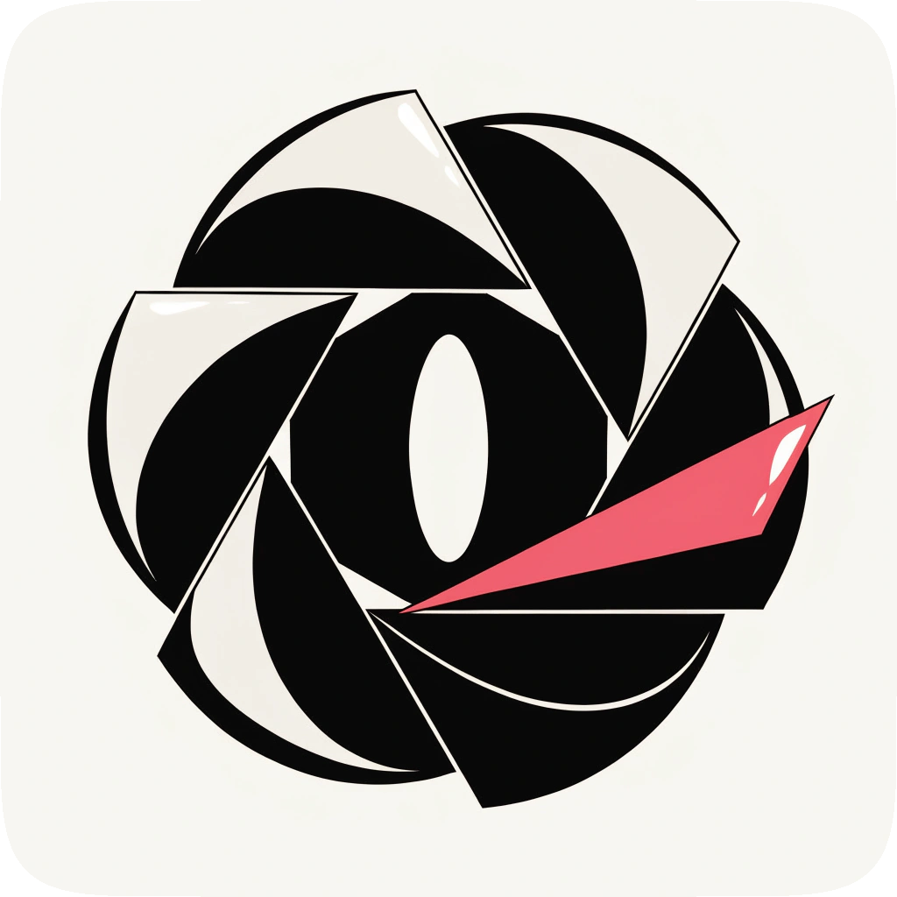
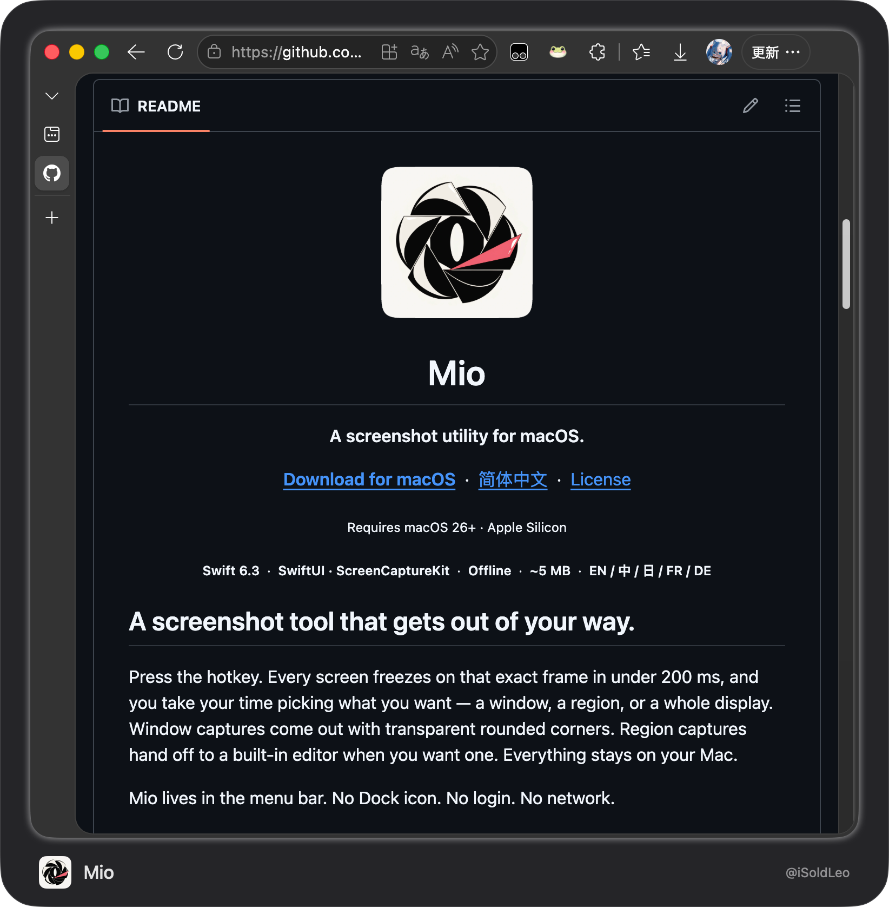
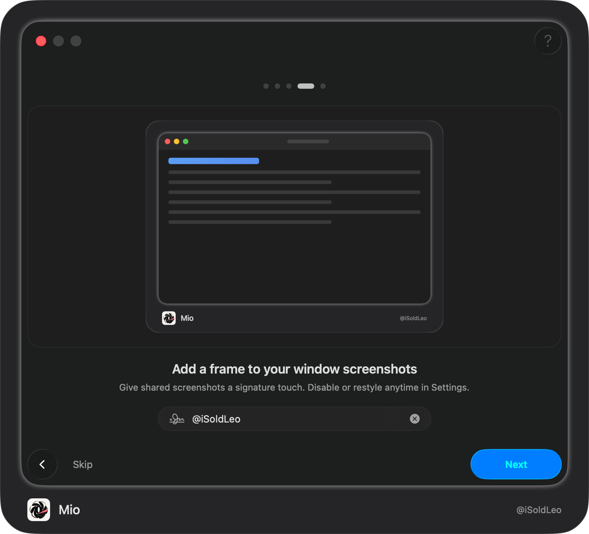
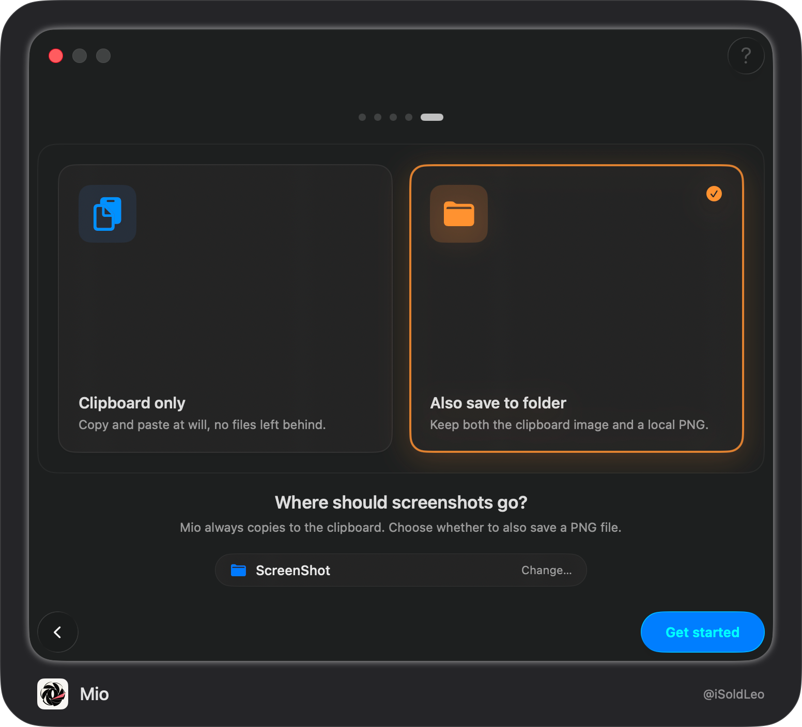

<div align="center">

<h1>Mio</h1>
<p><b>A screenshot utility for macOS.</b></p>
<p>
  <a href="https://github.com/iSoldLeo/Mio/releases/latest"><b>Download&nbsp;for&nbsp;macOS</b></a> &nbsp;·&nbsp; <a href="README-zh.md">简体中文</a> &nbsp;·&nbsp; <a href="LICENSE/GPL-3.0%20license">License</a>
</p>
<p><sub>Requires macOS 15+ · Apple Silicon</sub></p>
<p><sub><b>Swift 6.3</b> &nbsp;·&nbsp; <b>SwiftUI · ScreenCaptureKit</b> &nbsp;·&nbsp; <b>Offline</b> &nbsp;·&nbsp; <b>~5&nbsp;MB</b> &nbsp;·&nbsp; <b>EN&nbsp;/&nbsp;中&nbsp;/&nbsp;日&nbsp;/&nbsp;FR&nbsp;/&nbsp;DE</b></sub></p>
</div>

## A screenshot tool that gets out of your way.

Press the hotkey. Every screen freezes on that exact frame in under 80&nbsp;ms, and you take your time picking what you want — a window, a region, or a whole display. Window captures come out with transparent rounded corners. Region captures hand off to a built-in editor when you want one. Everything stays on your Mac.

Mio lives in the menu bar. No Dock icon. No login. No network.

<br>

<p align="center">
  
</p>
<p align="center">
  
</p>
<p align="center">
  
</p>

<br>

## What's new

- **Built-in editor.** Six tools, three thicknesses, seven preset colors, screen color picker.
- **Window capture with transparent corners.** No more wallpaper bleeding into the rounded edges.
- **Three independent shortcuts.** Quick window, advanced window (into editor), and full screen.

<br>

## Highlights

**Capture**
- Per-screen freeze in under 80&nbsp;ms — pick from still images, not a moving target
- Window-aware hover; click for a clean cut, drag for a region
- Multi-display picker for full screen capture

**Edit**
- Rectangle, ellipse, arrow, brush, mosaic, text
- Vector text annotations stay editable until you confirm
- Mosaic granularity is fixed so redactions can't leak
- Pick any color from anywhere on your screen

**Native**
- Menu bar only, accessory app
- Strict Concurrency, no third-party SDKs
- Zero network access, zero analytics

<br>

## Get started

Download `Mio.app` from [Releases](https://github.com/iSoldLeo/Mio/releases/latest), drag it to **Applications**, and open it. Grant **Screen Recording** when prompted.

> If macOS asks about an unidentified developer the first time, open **System Settings → Privacy & Security**, scroll to the prompt, and click **Open Anyway**.

<br>

## Privacy

Mio runs entirely on your Mac. Screenshots go to the clipboard and, if you opt in, to a folder you choose. Nothing leaves the device. There's no account, no telemetry, no analytics — the app does not open a network connection at all.

<br>

## Info

Developer · [iSoldLeo](https://github.com/iSoldLeo) · [MeowLynxSea](https://github.com/MeowLynxSea) &nbsp;·&nbsp;
Source · [github.com/iSoldLeo/Mio](https://github.com/iSoldLeo/Mio) &nbsp;·&nbsp;
Issues · [Report a bug](https://github.com/iSoldLeo/Mio/issues) &nbsp;·&nbsp;
License · [GPL-3.0](LICENSE/GPL-3.0%20license)

<details>
<summary>Build from source</summary>

```sh
git clone https://github.com/iSoldLeo/Mio.git
cd Mio
open Mio.xcodeproj
```

Requires Xcode 26+. Select the `Mio` scheme and run.

</details>
